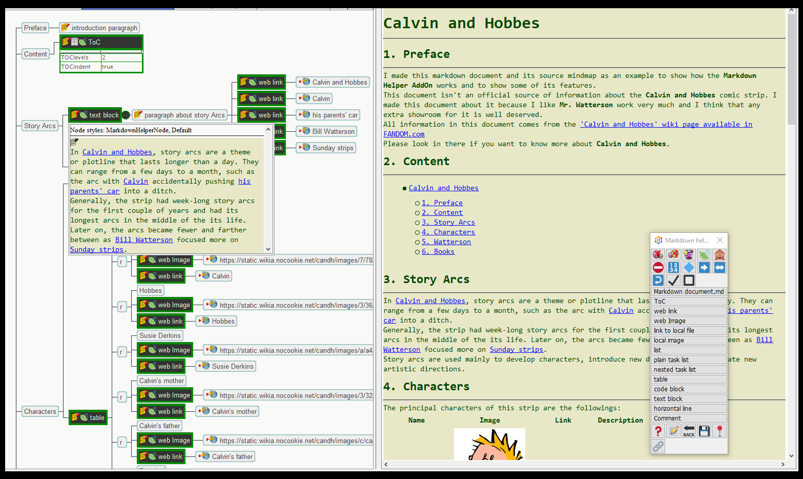
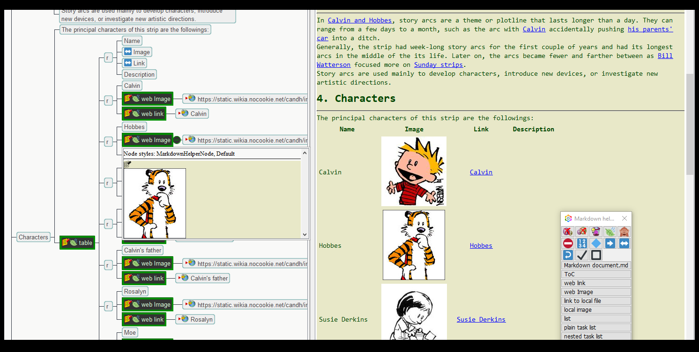

# Markdown Helper Add On for Freeplane

-----

Welcome to the **alpha** version of the **Markdown Helper AddOn** for **Freeplane**.

This Add On is a tool to create markdown documents in a Freeplane mindmapping way.

More information, instructions and examples in the [Markdown Helper **wiki**](https://github.com/EdoFro/Freeplane_MarkdownHelper/wiki) page.

# How it works

-----

The general idea of this AddOn is to insert **special nodes** in your map that help to **translate** the information in a mindmap **into a Markdown** document.

Here you can see an example where a **paragraph** is **combined with** nodes with links to **images** and **webpages** into a Markdown formatted text.

You obtain a good looking document retaining the **flexibility** that offers Freeplane and Mindmapping. You can easy reorder and insert new ideas as usual.

More information, instructions and examples in the [Markdown Helper **wiki**](https://github.com/EdoFro/Freeplane_MarkdownHelper/wiki) page.

# Some screenshots

-----

## 1. Mindmap and notepanel

-----

### 1.1. Building a textblock with links to webpages

### 1.2. Building a table

More information, instructions and examples in the [Markdown Helper **wiki**](https://github.com/EdoFro/Freeplane_MarkdownHelper/wiki) page.

# Example animations

-----

## 1. ToC example

-----

## 2. List example

-----

## 3. Table example

-----

More information, instructions and examples in the [Markdown Helper **wiki**](https://github.com/EdoFro/Freeplane_MarkdownHelper/wiki) page.

# This AddOn is still beta

-----

So it may have a lot of bugs. Use it at your own risk. (**Freeplane** has an excelent "*Undo*" implementation, so the risk is in fact very limited)

Please report any bug in this addOn in its GitHub page

# Your Help needed

-----

I'm not very good at writing in english, so if you find any error please tell me (and please explain me how to write it correctly)

# About Freeplane

-----

[Freeplane](https://www.freeplane.org/wiki/index.php/Home) is a free and open source software application that supports thinking, sharing information and getting things done at work, in school and at home. The software can be used for [mind mapping](https://secure.wikimedia.org/wikipedia/en/wiki/Mind_map) and analyzing the information contained in mind maps. Freeplane runs on any operating system that has a current version of Java installed. It can be run locally or [portably](https://en.wikipedia.org/wiki/Portable_application) from removable storage like an USB drive.

